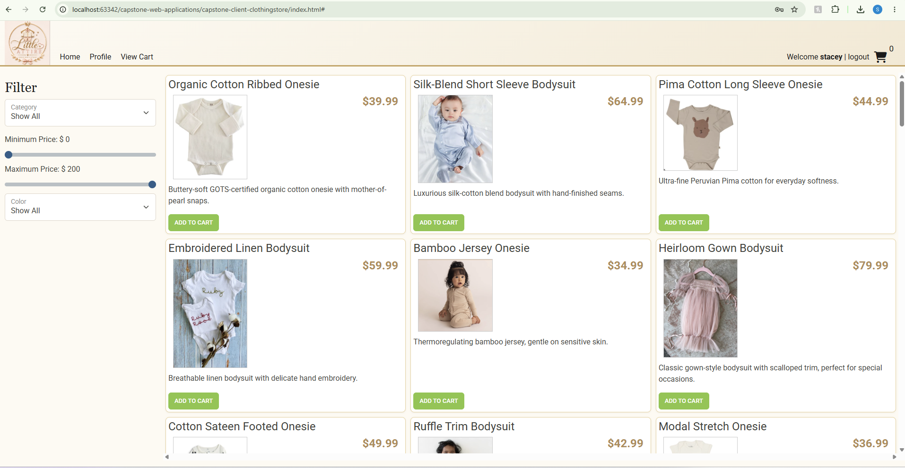
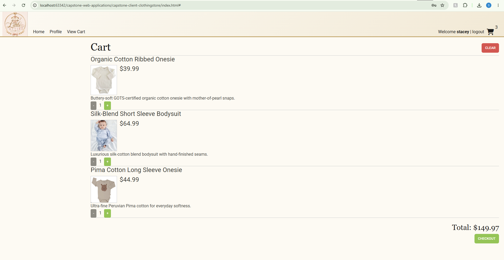
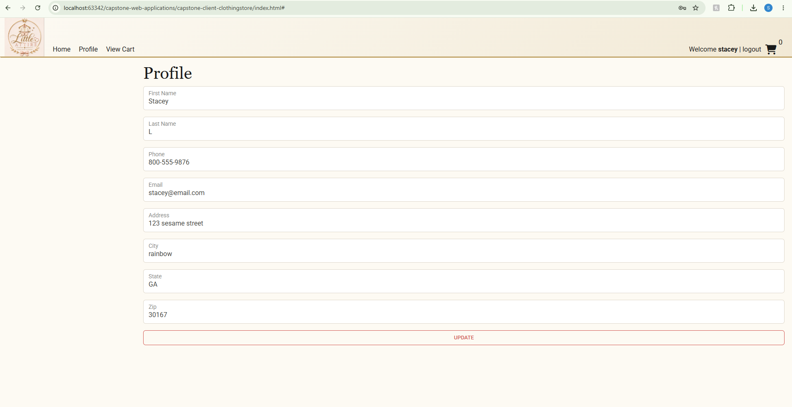
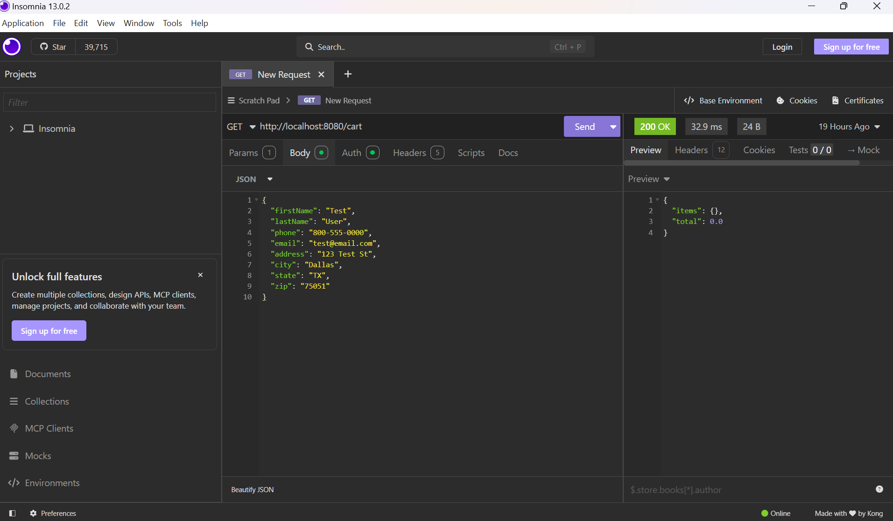

# Little Attire

A luxury baby clothing e-commerce REST API, built as a solo capstone project for Year Up United's Software Development track. Little Attire extends an existing Spring Boot + MySQL e-commerce starter project, with the backend fully rebuilt and customized for a baby clothing storefront.

## About the Project

Little Attire allows customers to browse curated luxury baby clothing by category (Onesies & Bodysuits, Outerwear & Sets, Footwear & Accessories), filter by price and color, add items to a persistent shopping cart, manage their profile, and check out to place an order. Admin users can manage the product and category catalog.

This project started from a partially-implemented Spring Boot starter codebase containing two intentional bugs and several unimplemented features. All backend work below was completed from scratch or debugged and fixed:

### Bugs Fixed
- **Search bug** — `GET /products` was silently filtering out every non-featured product due to a leftover `.filter(Product::isFeatured)` line unrelated to the actual search parameters. Removed the erroneous filter so all matching products now return correctly.
- **Stock update bug** — `PUT /products/{id}` returned 200 OK but silently failed to persist stock changes, because `ProductService.update()` never copied the incoming `stock` value onto the entity before saving. Added the missing `setStock()` call.

### Features Implemented
- **Categories** (`CategoriesController` / `CategoryService`) — full CRUD, with create/update/delete restricted to admin users.
- **Shopping Cart** (`ShoppingCartController` / `ShoppingCartService`) — view cart, add product (increments quantity if already present), update quantity, and clear cart. Cart persists across logins.
- **Profile** (`ProfileController` / `ProfileService`) — view and update the logged-in user's profile.
- **Checkout** (`OrderController` / `OrderService` / `Order` / `OrderLineItem`) — converts the current user's shopping cart into an order with line items, pulling shipping address from the user's profile, then clears the cart.

### Tech Stack
- Java 17, Spring Boot, Spring Security (JWT authentication, role-based authorization)
- MySQL, Spring Data JPA / Hibernate
- Vanilla JS frontend (Mustache templates, Axios, Bootstrap)
- Insomnia for endpoint testing

## Database

The `database/` folder contains the database script (`little_attire.sql`). Run it in MySQL Workbench to create the `littleattire` schema with all tables and seed data (3 demo users — `user`, `admin`, `george`, all password `password`).

Update `src/main/resources/application.properties` to point at the `littleattire` database before running the application.

## Running the Project

1. Run the database script in MySQL Workbench.
2. Update `application.properties` with your MySQL credentials.
3. Run `ECommerceApplication.java` from IntelliJ (or `mvn spring-boot:run`).
4. The API runs on `http://localhost:8080`.
5. Open the frontend `index.html` to browse the store, or use Insomnia to test endpoints directly.

## Screenshots

*(Add screenshots here: home page with product grid, cart page, profile page, and an Insomnia request/response example.)*






## Interesting Code: Building the Shopping Cart from the Database

One of the more interesting pieces of logic is in `ShoppingCartService.getByUserId()`. The `shopping_cart` table only stores `userId`, `productId`, and `quantity` — it doesn't store full product details. To return a cart that includes complete product information (name, price, description, image, etc.) for the frontend to render, each cart row has to be combined with a live lookup of its product:

```java
public ShoppingCart getByUserId(int userId)
{
    ShoppingCart cart = new ShoppingCart();

    List<CartItem> cartItems = shoppingCartRepository.findByUserId(userId);

    for (CartItem cartItem : cartItems)
    {
        Product product = productService.getById(cartItem.getProductId());

        ShoppingCartItem item = new ShoppingCartItem();
        item.setProduct(product);
        item.setQuantity(cartItem.getQuantity());

        cart.add(item);
    }

    return cart;
}
```

This same method is reused in three places: building the cart for `GET /cart`, rebuilding the cart after adding/updating a product so the response always reflects the latest state, and — most importantly — in `OrderService.createOrderFromCart()`, where the same cart-building logic is used to read out exactly what needs to become order line items at checkout. Keeping this logic in one method, rather than duplicating the join-and-build pattern in multiple places, meant the checkout feature could be built by composing existing, already-tested services rather than writing new lookup logic from scratch.

## Future Versions

Features considered for future iterations, in rough priority order:

1. **Order history** — let customers view past orders (`GET /orders`).
2. **Product reviews/ratings** — allow customers to leave reviews on purchased products.
3. **Wishlist** — separate from the cart, a saved-for-later list.
4. **Admin dashboard UI** — a dedicated frontend view for managing products/categories instead of requiring Insomnia/API calls.

